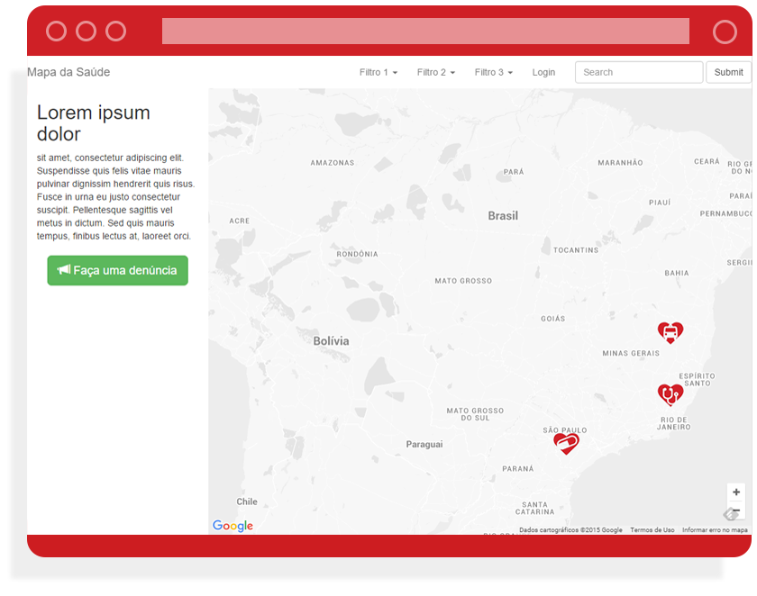

# Mapa da Saúde


## Objetivo
* Promover a reflexão dos problemas da área de saúde nacional.
* Criar uma ferramenta para possibilitar o mapeamento.
* Gerar visualização dos dados.

## Como funciona a Ferramenta
Os usuários do sistema de saúde público e privado poderão acessar o site, fazer seu cadastro e começar a inserir suas reclamações.

Ao realizar uma denúncia os usuários poderão determinar a localização, hospital, público ou particular, plano de saúde ou SUS, categoria(demora no atendimento, ausência de recursos, entre outros), data e descrição.
Com base nestas informações poderemos realizar visualizações relacionando as reclamações tanto geograficamente, quanto com base nos outros dados fornecidos.

## Como Contribuir
O projeto é realizado de forma co-autoral e aberta, sem ligações com nenhuma instituição que não a sociedade civíl.

Utilizaremos o Github, onde o código do projeto estará disponível para colaboração de designers e desenvolvedores:

https://github.com/Vamoss/MapaDaSaude

Através do sistema de Issues e Milestones do Github será estabelecido as metas e principais tarefas a serem desenvolvidas.

Sua colaboração será feita utilizando Pull requests ❤

### Executando o projeto
Instale o xampp e o composer

1. https://www.apachefriends.org/pt_br/download.html
2. https://getcomposer.org/download/

Pelo terminal, acesse a pasta do projeto e instale as dependências

```
composer install
npm install
```

Compilando os CSSs e JSs

```
npm run build
```

Criando o ambiente de desenvolvimento

1. crie um banco de dados no phpmyadmin, por exemplo "mapadasaude"
1. duplique o arquivo .env.example e renomeie para .env
2. altere no .env o DB_DATABASE, DB_USERNAME e DB_PASSWORD, geralmente é "mapadasaude", "root" e "" respectivamente 

Inicializando o banco de dados com tabelas e dados

```
php artisan migrate:refresh --seed
```

Rodando a aplicação

```
php artisan serve
```

Subindo versão atual para produção

```
npm run deploy
```

## Chega de Descaso
A definição de onde a ferramenta será publicada ainda está em aberto, apesar de haver a motivação em colaborar com o Movimento Chega de Descaso, projeto iniciado pelo Leandro Farias que perdeu sua esposa após esperar 28 horas por uma cirurgia.

Conheça mais sobre este projeto aqui:

http://www.chegadedescaso.com.br/

## Referências
### Onde fui roubado
www.ondefuiroubado.com.br

Esta é a principal referência, e seu diferencial é tratar do problema da segurança pública.

### Criativos locais
http://www.criativoslocais.com.br/

